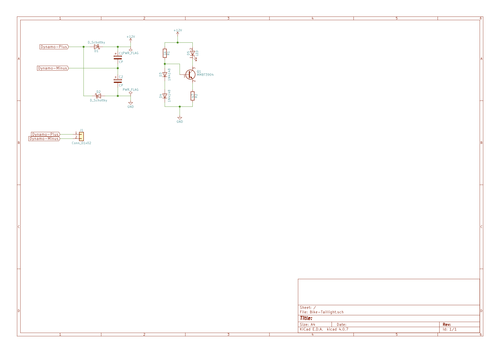

# Bike-Taillight
Schema for led driven bike taillight

Combining two simple standard circuits, you get a solid circuit for a bicycle rear light, which 
is operated by an LED. The circuit is simple. You need a constant current source for the LED 
and a Delon circuit as a bridge circuit.

The Delon circuit provides a DC voltage, where the voltage is doubled. This will provide up to 14 volts.
At the output of the Delon circuit is the constant current source with an NPN transsistor. Two 1N4148 diodes are used for biasing and will give approximately 1.4 volts. The current is determined via R2 and is calculated as (1.4 - 0.7) / R2. The circuit would use 47 ohms for R2 and therefore a current of approximately 15 mA should flow.

Depending on the transistor, the value may change slightly and depending on the LED used, the value can be adjusted via R2. 

Both circuits are described in every good electronics manual, so there is no magic at all!

